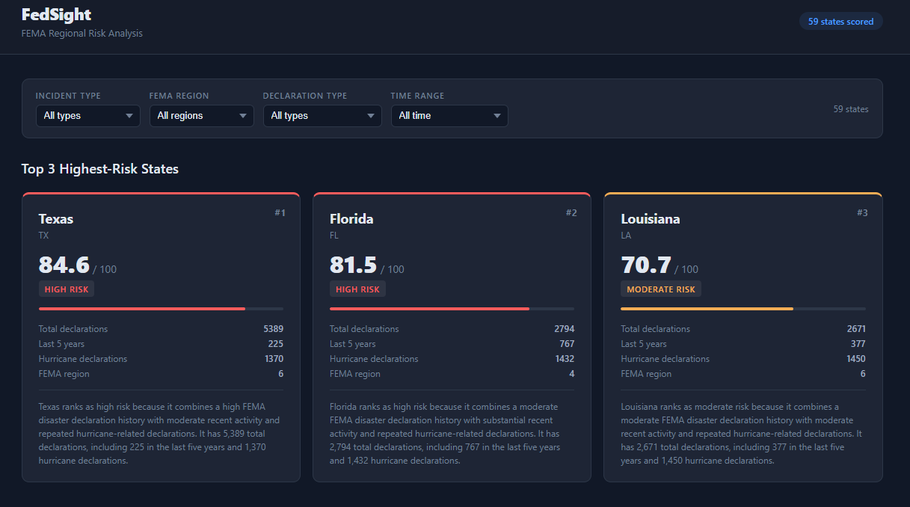
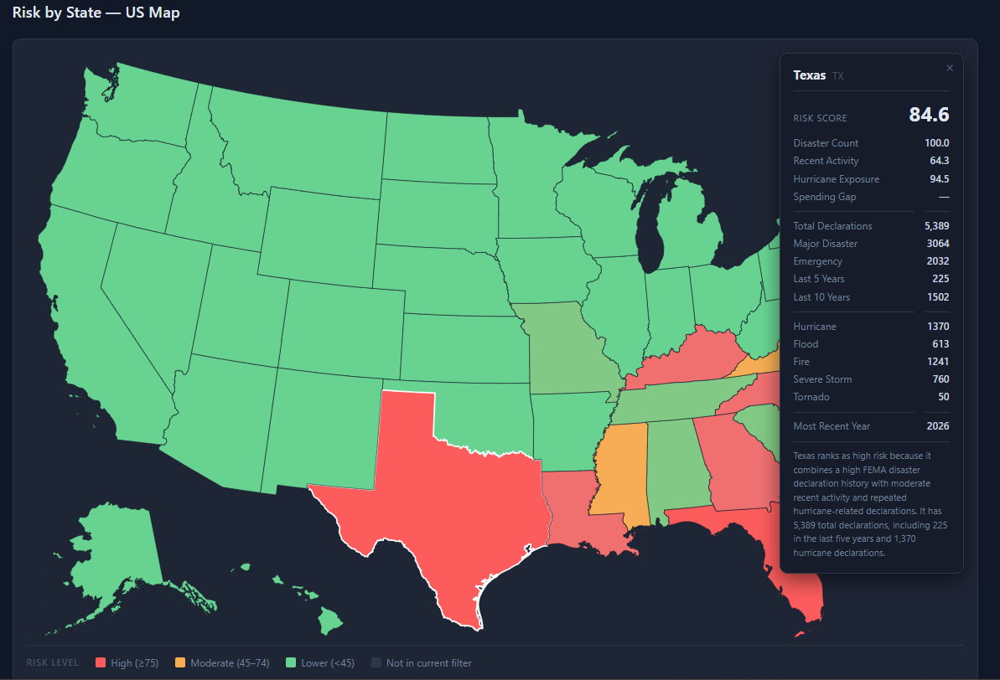

# FedSight

Decision-support tool for FEMA-style regional risk analysis. Combines FEMA disaster declarations, USAspending federal obligations, and NOAA hurricane track data into a state-level risk map.

## Screenshots





## Tech Stack

| Layer | Technology |
|---|---|
| API | FastAPI + Uvicorn |
| Database | PostgreSQL + SQLAlchemy |
| Frontend | React + TypeScript |
| Map | D3-geo + TopoJSON (SVG) |
| Charts | Recharts |
| Data ingestion | Python + psycopg2 + Requests |
| Backend tests | pytest + httpx TestClient |
| Frontend tests | Vitest + React Testing Library |

## Prerequisites

- Python 3.11+
- Node.js 18+
- PostgreSQL 15+

## Setup

### 1. Database

```bash
createdb fedsight
psql fedsight < db/schema.sql
```

### 2. Backend

```bash
python -m venv .venv
source .venv/bin/activate
pip install -r requirements.txt

cp .env.example .env
# Edit .env and set DATABASE_URL
```

### 3. Frontend

```bash
cd frontend
npm install
```

## Running

**Backend API**
```bash
uvicorn backend.main:app --reload
```

**Frontend**
```bash
cd frontend
npm run dev
```

## Data Ingestion

Run scripts in order after the database is created:

```bash
# 1. Load FEMA disaster declarations (~70 k records)
python -m ingestion.fema_declarations

# Limit to a single state for testing
python -m ingestion.fema_declarations --state TX

# 2. Aggregate declarations and compute state risk scores
python -m ingestion.aggregate_risk
```

USAspending and NOAA ingestion scripts are pending (build steps 4–5).

## API Endpoints

| Method | Path | Description |
|---|---|---|
| `GET` | `/health` | Liveness check |
| `GET` | `/api/states/risk` | All states ordered by risk score descending |
| `GET` | `/api/states/top?n=3` | Top *n* highest-risk states (1 ≤ n ≤ 10, default 3) |

## Project Structure

```
FedSight/
├── backend/          FastAPI app, routes, models
├── frontend/         React + TypeScript + map component
├── ingestion/        Data ingestion and risk-scoring scripts
├── db/               SQL schema
└── tests/            pytest backend tests
```

## Risk Score Composition

Each state receives a `final_risk_score` built from four sub-scores stored in `state_risk_scores`:

| Score | Source | Weight |
|---|---|---|
| `disaster_count_score` | FEMA declaration frequency | 30% |
| `recent_activity_score` | Declarations in last 5 / 10 years | 35% |
| `hurricane_exposure_score` | Hurricane-type FEMA declarations | 25% |
| `spending_gap_score` | USAspending obligations vs. disaster severity | 10% *(pending)* |

All sub-scores are min-max normalized to 0–100. `spending_gap_score` is `null` until the USAspending layer is loaded; its 10% weight is redistributed proportionally across the other three.

## Testing

**Backend**
```bash
pytest
```

**Frontend**
```bash
cd frontend
npm test
```
